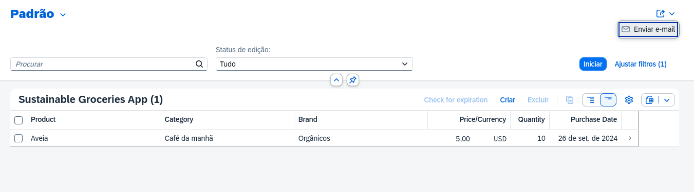
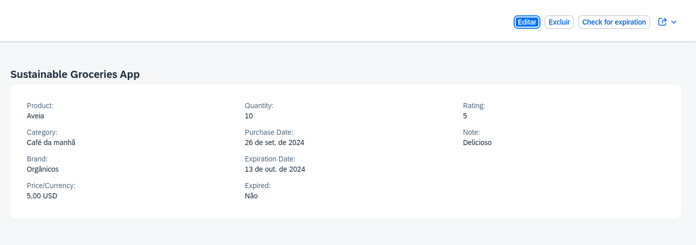

# APPGroceryABAPFioriElements
Aplicativo que cadastra, edita e exclui produtos e verifica se a validade expirou ou não de acordo com uma ação desenvolvida conforme imagem exemplificada na tela de detalhes.
Esse app foi feito com serviço RESTFull utilizando a linguagem SAP ABAP no ambiente ABAP-Cloud BTP Trial.

# Telas do app

1. Tela inicial

    

2. Tela de detalhes
    
